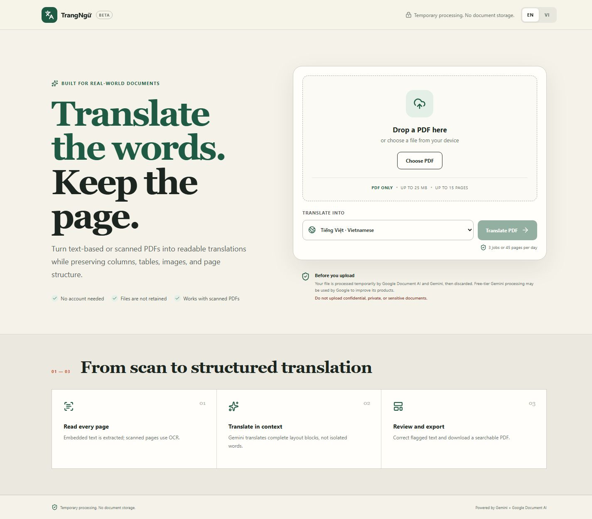

# TrangNgữ


**Translate the words, keep the page.** TrangNgữ is a layout-preserving PDF translator for digital and scanned documents. It is designed first for Vietnamese students, educators, nonprofits, and small teams who need useful translations without rebuilding every page by hand.

[Open the live app](https://trangngu-6m6au2eisq-as.a.run.app) · [Try the demo PDF](outputs/trangngu-demo-flood-guide.pdf) · [Read the architecture](docs/ARCHITECTURE.md) · [View on GitHub](https://github.com/thqhuong/trangngu)

> **Build status (2026-08-29):** the MVP is deployed and verified on Google Cloud Run, and the source is published on GitHub under the MIT License. The mixed digital/scanned demo PDF completed the real Document AI + Gemini workflow and exported successfully without required corrections. Google AI Studio sharing, YouTube, and the social post are still submission tasks and are not claimed as complete.

## Live deployment

- Public app: [https://trangngu-6m6au2eisq-as.a.run.app](https://trangngu-6m6au2eisq-as.a.run.app)
- Google Cloud project: `trangngu-ai-riser-2026` (separate from Doc2Do)
- Cloud Run service/revision: `trangngu` / `trangngu-00002-h2h`, with 100% of traffic
- Region and limits: `asia-southeast1`, minimum 0, maximum 2, 1 CPU, 2 GiB, concurrency 2, timeout 600 seconds
- Providers: Enterprise Document OCR processor `e0a3a06f46f66a72` and free-tier `gemini-3.5-flash-lite`
- Verification: public shell and health passed; 16 automated tests passed; 6 production Playwright tests passed across desktop Chromium and Pixel 7; real two-page translation/OCR/export passed; no error-severity Cloud Run logs remained

The project has a monthly ₫100,000 warning budget with 50%, 90%, 100%, and 90%-forecast thresholds. This is an alert, not a spending cap. The application additionally reserves at most 900 OCR pages per month.

## MVP at a glance

- PDF only, up to **25 MB** and **15 pages per job**.
- Three jobs and **45 pages per requester per day**.
- Embedded-text extraction first; Google Cloud Document AI OCR for scan-like pages.
- Gemini translates identified text blocks on the server with structured, validated JSON.
- A review workspace keeps blocks aligned with the source page and flags uncertain or overflowing text.
- Export creates a fixed-layout PDF with a searchable translated text layer.
- No account required and no original document storage by TrangNgữ.
- 12 target languages: Vietnamese, English, Simplified Chinese, Japanese, Korean, Thai, Indonesian, French, German, Spanish, Portuguese, and Hindi.

The intended demo magic moment is a scanned foreign-language page becoming Vietnamese in place while its columns, table, images, and overall geometry remain recognizable.

## Product preview



The same upload, comparison, review, and export workflow is designed for desktop and mobile browsers. The checked-in demo fixture is rights-safe and contains one embedded-text page plus one image-only scanned page.

## Architecture

TrangNgữ uses one TypeScript repository and one Cloud Run service:

```text
Browser (React + Vite)
        |
        | HTTPS multipart / NDJSON / PDF
        v
Fastify API on Cloud Run
  |-- PDF.js / Poppler: inspect and render PDFs
  |-- Document AI: OCR scan-like pages
  |-- Gemini API: schema-constrained block translation
  |-- Firestore: privacy-preserving usage counters only
  `-- pdf-lib + Noto fonts: fixed-layout export
```

The backend serves both `/api/*` and the built React application in production. Gemini and Document AI credentials never belong in browser code. See [Architecture](docs/ARCHITECTURE.md) and [MVP specification](docs/MVP_SPEC.md).

## Local setup

### Prerequisites

- Node.js 22 or later
- npm 10 or later
- Poppler and Noto fonts when exercising PDF rendering/export outside Docker
- A Google Cloud project with Application Default Credentials for real Document AI and Firestore tests
- A Gemini API key from Google AI Studio for real translation tests

### Run the application

```bash
npm ci
cp .env.example .env
npm run dev
```

Open `http://localhost:5173`. Vite proxies `/api` to Fastify on port 8787. The health check is `http://localhost:8787/api/health`.

The interface and health endpoint can start without cloud credentials; development mode clearly labels its non-AI translation preview. Real translation and scanned-page OCR require the provider values below. Never commit `.env` or paste a secret into browser code, screenshots, logs, documentation, or command history.

### Environment variables

| Variable | Required for full workflow | Default | Purpose |
|---|---:|---|---|
| `NODE_ENV` | No | `development` | `development`, `test`, or `production` |
| `HOST` | No | `0.0.0.0` | Fastify listen host |
| `PORT` | No | `8787` locally | Fastify listen port; Cloud Run injects `8080` |
| `GEMINI_API_KEY` | Yes | none | Server-only Gemini Developer API key |
| `GEMINI_MODEL` | Yes | `gemini-3.5-flash-lite` | Configurable model; reverify free-tier availability before deployment |
| `GOOGLE_CLOUD_PROJECT` | Yes | none | Project containing Document AI and Firestore |
| `DOCUMENT_AI_LOCATION` | Yes for scans | `asia-southeast1` | OCR processor location |
| `DOCUMENT_AI_PROCESSOR_ID` | Yes for scans | none | Enterprise Document OCR processor ID |
| `SESSION_SIGNING_SECRET` | Yes | none | At least 32 characters; signs short-lived review sessions |
| `IP_HASH_SALT` | Yes | none | At least 16 characters; salts requester identifiers |
| `MAX_PDF_BYTES` | No | `26214400` | 25 MB upload limit |
| `MAX_PAGES_PER_JOB` | No | `15` | Maximum pages in one PDF |
| `DAILY_JOB_LIMIT` | No | `3` | Jobs per requester per UTC day |
| `DAILY_PAGE_LIMIT` | No | `45` | Pages per requester per UTC day |
| `MONTHLY_OCR_PAGE_CAP` | No | `900` | Global scanned-page reservation guardrail |
| `SESSION_TTL_MINUTES` | No | `30` | Review/export session lifetime |
| `GEMINI_TIMEOUT_MS` | No | `90000` | Per-call Gemini timeout |
| `DOCUMENT_AI_TIMEOUT_MS` | No | `90000` | Per-call OCR timeout |
| `PDF_RENDER_TIMEOUT_MS` | No | `120000` | Poppler export-render timeout |
| `POPPLER_BIN_PATH` | No | system `PATH` | Directory containing `pdftoppm` |
| `PDF_FONT_REGULAR_PATH` | No | detected system font | Unicode TTF used for translated export text |
| `FIRESTORE_DATABASE_ID` | No | `(default)` | Firestore database containing usage counters |

For local Google Cloud authentication, prefer Application Default Credentials:

```bash
gcloud auth application-default login
gcloud config set project YOUR_PROJECT_ID
```

Do not download a long-lived service-account key for local development unless there is no safer option.

## Development and testing

```bash
npm run typecheck
npm run lint
npm test
npm run build
npx playwright install chromium
npm run test:e2e
node scripts/check-doc-links.mjs
```

`npm run check` runs type checking, linting, unit tests, and the production build. Playwright runs the shell, health, and horizontal-overflow smoke checks in desktop Chrome and a Pixel 7 viewport.

Before calling the MVP complete, also test representative digital, scanned, and mixed PDFs; invalid/encrypted/oversized inputs; malformed and timed-out model responses; corrections and export; searchable translated text; and quota handling. Mocked providers do not replace one real Gemini request and one real Document AI request.

## Privacy and cost warning

TrangNgữ is designed to process source files temporarily and not retain original PDFs or translated results. The planned persistent data is limited to salted, one-way requester usage counters in Firestore. Logs must exclude document text, translations, PDFs, secrets, and session tokens.

The Gemini Developer API free tier currently states that submitted content may be used to improve Google products. **Do not upload confidential, personal, regulated, or otherwise sensitive documents.** Terms, quotas, model availability, and pricing can change; check the [official Gemini pricing page](https://ai.google.dev/gemini-api/docs/pricing) immediately before a public launch. See [Privacy](docs/PRIVACY.md).

Document AI currently lists the first 1,000 Enterprise OCR pages per month at no charge, then usage-based pricing. TrangNgữ reserves at most 900 scanned pages in its own counter, but this application limit is not a billing cap. Review the [official Document AI pricing](https://cloud.google.com/products/document-ai/pricing), configure a Google Cloud budget alert, and inspect actual usage. Budget alerts notify; they do not stop spending.

## Cloud Run deployment

Deployment is manually controlled. Before running any command, confirm the active project is the dedicated TrangNgữ project, not an existing application project. Enabling APIs, creating resources, and attaching billing require the project owner's approval.

The target service is `trangngu` in `asia-southeast1`: public access, minimum 0 instances, maximum 2, 1 CPU, 2 GiB memory, concurrency 2, and a 600-second request timeout. Secrets come from Secret Manager. The runtime identity is a dedicated least-privilege service account.

Follow [How to deploy TrangNgữ](docs/DEPLOYMENT.md). The checked-in [Cloud Build configuration](cloudbuild.yaml) builds the [multi-stage container](Dockerfile), pushes it to Artifact Registry, and deploys with the target resource limits. It requires the real Document AI processor ID as a substitution and pre-created resources/secrets.

After deployment, verify the URL without claiming success in advance:

```bash
node scripts/smoke-production.mjs https://YOUR_CLOUD_RUN_URL
PLAYWRIGHT_BASE_URL=https://YOUR_CLOUD_RUN_URL npm run test:e2e
```

Then translate the pre-tested scan fixture through the real production Gemini and Document AI path, download and inspect the result, confirm 100% traffic on the latest revision, and check sanitized Cloud Run logs.

## Demo and submission

- [Rights-safe two-page mixed PDF fixture](outputs/trangngu-demo-flood-guide.pdf)
- [Demo script and stable scenario](docs/DEMO_SCRIPT.md)
- [Google AI Studio prompt and output schema](docs/AI_STUDIO.md)
- [Social post draft](docs/SOCIAL_POST.md)
- [Submission checklist](docs/SUBMISSION_CHECKLIST.md)

The live demo should remain under three minutes: state the problem, upload the two-page fixture, show in-place Vietnamese translation and the comparison view, explain Gemini plus Document AI, download the PDF, and finish on the verified Cloud Run URL. Do not use a fake AI response.

## Documentation

- [MVP specification](docs/MVP_SPEC.md): audience, workflow, limits, exclusions, and acceptance criteria
- [Architecture](docs/ARCHITECTURE.md): data flow, security boundaries, and trade-offs
- [Deployment guide](docs/DEPLOYMENT.md): Google Cloud resources, secrets, Cloud Build, verification, and rollback
- [Privacy](docs/PRIVACY.md): temporary processing, provider disclosure, logs, and deletion behavior
- [Contributing](CONTRIBUTING.md): local setup, quality gates, and pull-request expectations
- [Security policy](SECURITY.md): supported version and private vulnerability reporting
- [Changelog](CHANGELOG.md): shipped product and deployment milestones
- [GitHub publishing guide](docs/GITHUB_PUBLISHING.md): repository metadata, settings, and launch checklist

## License

MIT. See [LICENSE](LICENSE).
